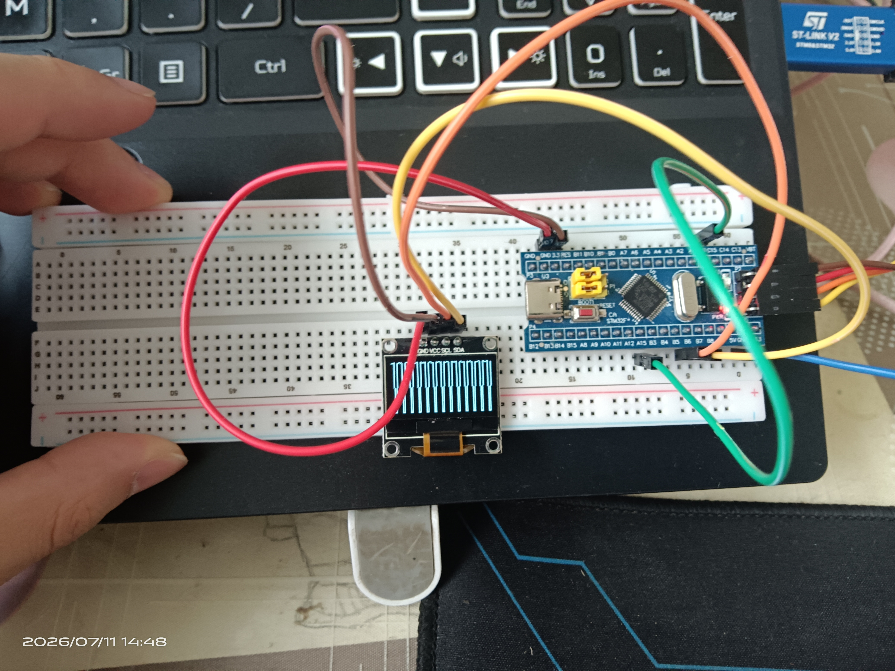
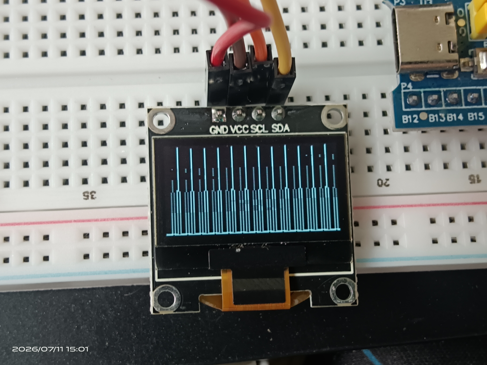

# 基于stm32F103C8T6和oled的简易示波器
## 他能做什么？
### 做简单的示波工作
工作如图

## 基本原理
利用内置的adc外设进行取样
oled输出图像
## 线路接线
A0------

GND----

B6----SCL

B7----SDA

3.3-----VCC(OLED)
v
GND----GND(OLED)

## 参数
采样频率 1ms

## 验证
```c
 htim2.Instance = TIM2;
  htim2.Init.Prescaler = 719;
  htim2.Init.CounterMode = TIM_COUNTERMODE_UP;
  htim2.Init.Period = 999;
  htim2.Init.ClockDivision = TIM_CLOCKDIVISION_DIV1;
  htim2.Init.AutoReloadPreload = TIM_AUTORELOAD_PRELOAD_DISABLE;
  if (HAL_TIM_Base_Init(&htim2) != HAL_OK)
  {
    Error_Handler();
  }
  sClockSourceConfig.ClockSource = TIM_CLOCKSOURCE_INTERNAL;
  if (HL_TIM_ConfigClockSource(&htim2, &sClockSourceConfig) != HAL_OK)
  {
    Error_Handler();
  }
  if (HAL_TIM_PWM_Init(&htim2) != HAL_OK)
  {
    Error_Handler();
  }
  sMasterConfig.MasterOutputTrigger = TIM_TRGO_RESET;
  sMasterConfig.MasterSlaveMode = TIM_MASTERSLAVEMODE_DISABLE;
  if (HAL_TIMEx_MasterConfigSynchronization(&htim2, &sMasterConfig) != HAL_OK)
  {
    Error_Handler();
  }
  sConfigOC.OCMode = TIM_OCMODE_PWM1;
  sConfigOC.Pulse = 100;
  sConfigOC.OCPolarity = TIM_OCPOLARITY_HIGH;
  sConfigOC.OCFastMode = TIM_OCFAST_DISABLE;
```
可以推断十分之一的时间为高电压，烧录验证
成功
### 七月18日 添加采样频率的切换按钮